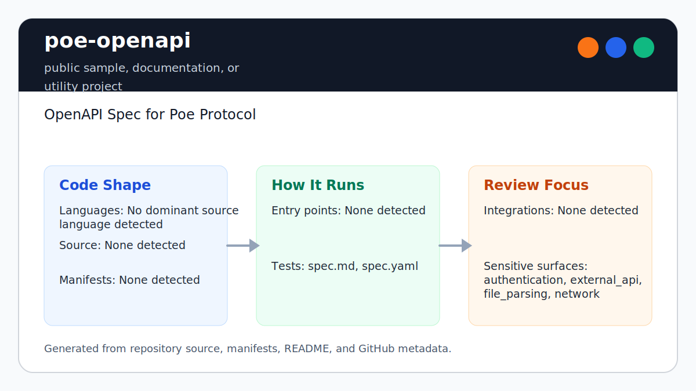

# poe-openapi

Generator parser recursion failures produce one stable diagnostic before
`spec.md` can be replaced. Loaded YAML graphs use bounded iterative validation
so deep acyclic aliases cannot exhaust the Ruby call stack.

<!-- README-OVERVIEW-IMAGE -->


## Overview

`garethpaul/poe-openapi` is a public sample, documentation, or utility project. OpenAPI Spec for Poe Protocol

This README is based on the checked-in source, manifests, scripts, and repository metadata on the `main` branch. The project language mix found during review was: no dominant source language detected.

## Repository Contents

- `README.md` - project overview and local usage notes
- `CHANGES.md` - notable maintenance changes
- `Makefile` - local verification entry points
- `.github/workflows/check.yml` - hosted OpenAPI contract validation
- `SECURITY.md` - security reporting and disclosure guidance
- `docs/plans` - completed engineering plans and verification records
- `scripts` - deterministic OpenAPI validation checks
- `scripts/check-baseline.sh` - repository maintenance baseline guard
- `VISION.md` - project direction and maintenance guardrails

Additional scan context:

- Source directories: scripts
- Dependency and build manifests: Makefile
- Entry points or build surfaces: Makefile, spec.md, spec.yaml
- Test-looking files: scripts/validate-openapi.rb, spec.md, spec.yaml

## Getting Started

### Prerequisites

- Git
- Ruby and `make`

### Setup

```bash
git clone https://github.com/garethpaul/poe-openapi.git
cd poe-openapi
```

The setup commands above are derived from repository files. Legacy mobile, Python, or JavaScript samples may require older SDKs or package versions than a modern workstation uses by default.

## Running or Using the Project

- Read `spec.yaml` as the source OpenAPI contract.
- Read generated `spec.md` as the human-oriented endpoint reference.
- Run `make generate` after changing `spec.yaml`; do not edit `spec.md`
  directly.

## Testing and Verification

- Run `make check` or `make verify` before committing OpenAPI or reference documentation changes.
- GitHub Actions runs the same dependency-free `make check` gate for pushes to
  `main`, pull requests, and manual dispatches. Checkout credentials are not
  persisted, Ruby setup is pinned, and the baseline runs on Ruby 2.7 and 3.3
  while enforcing the complete workflow contract.
- Run `make build` for the static OpenAPI contract build gate; it uses the same
  dependency-free validator as `make lint`.
- Run `make generate` to deterministically regenerate `spec.md` from
  `spec.yaml`. The validator rejects any byte-level generated-reference drift.
- Run `scripts/check-baseline.sh` for the repository baseline guard.
- `scripts/validate-openapi.rb` resolves repository inputs from its own
  location, so it can be invoked from any working directory.
- The verification gate parses `spec.yaml` and checks endpoint, operation ID,
  request-field documentation, response status documentation,
  security scheme, and shared
  error-response coverage against `spec.md`.
- Every operation ID must be a non-empty string, remain unique across the
  specification, and match the corresponding Markdown endpoint section.
- Every top-level JSON request-body property, required or optional, must stay
  named in the matching Markdown endpoint section.
- Example `example.com` servers must stay explicitly marked as placeholders in
  both the YAML and Markdown reference.
- The Markdown Error Handling section must document each field in the shared
  `Error` schema.
- The Markdown Security section must name every OpenAPI security scheme and the
  concrete header or HTTP scheme it uses.
- Every OpenAPI security scheme must include a non-empty `description` so
  generated docs explain how credentials are supplied.
- Every OpenAPI operation must declare a non-empty operation-level security
  requirement that names a configured security scheme.
- Standard OpenAPI Path Item metadata is accepted without being treated as an
  operation; unknown fields and non-object path or operation shapes fail closed.
- Every OpenAPI component schema and schema property must include a non-empty
  `description` so generated clients and readers retain payload and field-level
  semantics.
- Every OpenAPI schema `required` entry must name a property declared on that
  same schema so generated clients do not inherit impossible payload contracts.
- Every OpenAPI `$ref` must be a local string and resolve through its JSON
  Pointer so the contract stays self-contained and component renames or
  reference typos cannot leave generated clients with dangling types.
- Validator mutations reject external URLs, relative files, non-string values,
  and dangling references while accepting correctly escaped JSON Pointer `/`
  and `~` tokens.
- Every OpenAPI response must include a non-empty `description` so generated
  documentation retains the meaning of each status code.
- The baseline script checks required files, validator wiring, completed
  docs-plan metadata, hosted workflow permissions and action pinning,
  location-independent invocation, verification documentation, and local
  secret/editor metadata hygiene.

When the required SDK or runtime is unavailable, use static checks and source review first, then verify on a machine that has the matching platform toolchain.

## Configuration and Secrets

- The scan found credential-adjacent names. Review configuration paths before running against real accounts.

## Security and Privacy Notes

- Review changes touching authentication or token handling; examples from the scan include spec.md, spec.yaml.
- Review changes touching external API calls or credential-adjacent configuration; examples from the scan include spec.md, spec.yaml.
- Review changes touching network requests, sockets, or service endpoints; examples from the scan include spec.md, spec.yaml.
- Review changes touching file, media, JSON, XML, CSV, OCR, or data parsing; examples from the scan include spec.md, spec.yaml.

## Maintenance Notes

- See `SECURITY.md` for vulnerability reporting and safe research guidance.
- See `VISION.md` for project direction and contribution guardrails.
- See `CHANGES.md` for maintenance history.
- See `docs/plans/2026-06-08-placeholder-server-validation.md` for the current
  canonical completed engineering plan.
- See `docs/plans/2026-06-08-response-status-reference-validation.md` for the
  response-status reference guard.
- See `docs/plans/2026-06-09-error-schema-reference-validation.md` for the
  Error schema documentation guard.
- See `docs/plans/2026-06-09-security-scheme-reference-validation.md` for the
  security-scheme documentation guard.
- See `docs/plans/2026-06-10-security-scheme-description-validation.md` for
  the security-scheme description guard.
- See `docs/plans/2026-06-09-operation-security-validation.md` for the
  operation-level security requirement guard and static `make build` gate.
- See `docs/plans/2026-06-09-schema-property-description-validation.md` for
  the schema-property description guard.
- See `docs/plans/2026-06-09-component-schema-description-validation.md` for
  the component-schema description guard.
- See `docs/plans/2026-06-09-request-property-reference-validation.md` for
  request-property reference validation in `spec.md`.
- See `docs/plans/2026-06-09-required-property-validation.md` for recursive
  OpenAPI required-property validation.
- See `docs/plans/2026-06-09-scripted-baseline-check.md` for the scripted
  repository baseline guard.
- See `docs/plans/2026-06-10-hosted-openapi-validation.md` for hosted contract
  validation and location-independent script execution.
- See `docs/plans/2026-06-10-local-reference-validation.md` for recursive local
  OpenAPI reference validation.
- See `docs/plans/2026-06-12-response-description-validation.md` for required
  response-description validation and its mutation test.
- See `docs/plans/2026-06-12-credential-free-openapi-validation.md` for the
  exact credential-free hosted workflow and reference mutation coverage.
- See `docs/plans/2026-06-12-self-contained-reference-validation.md` for the
  local-only OpenAPI reference contract and its mutation coverage.
- See `plans/2026-06-08-request-field-reference-validation.md` for the current
  request-field documentation guard.

## Contributing

Keep changes small and tied to the project that is already present in this repository. For code changes, document the toolchain used, avoid committing generated dependency directories or local configuration, and update this README when setup or verification steps change.
